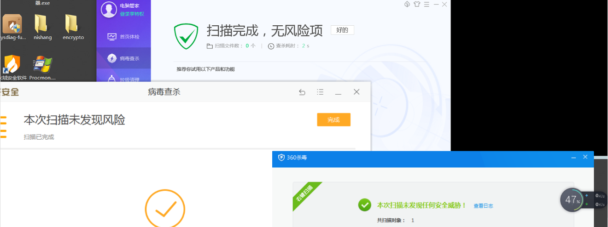
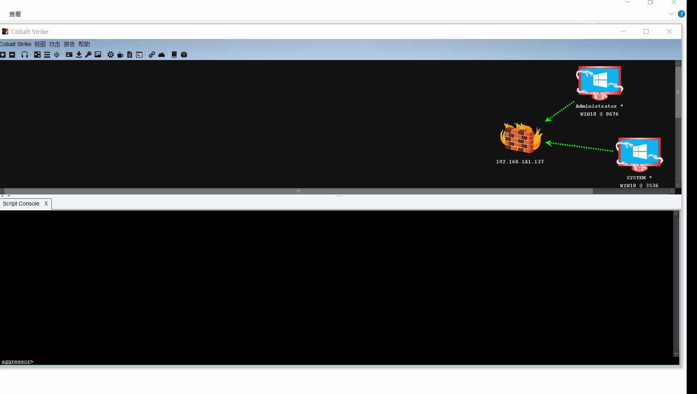

# 前言
仅用于技术交流，请勿用于非法用途

这个插件没有什么技术含量，旨在用于快速生成免杀的可执行文件，目前仅支持exe文件格式。需要安装go环境，因为是用`go build`生成的

免杀效果如下图：

用法：导入之后，位置在：`attack` -> `BypassAV`，快捷键：`Ctrl+G`

## 2020/7/19更新

更新了弹出的黑窗口问题和Linux/Mac上不能生成问题以及修复一些bug，建议生成64位的，32位的vt上查杀有点多（不过360全家桶、火绒那些还是可以过的）

**注：** 用go打包体积可能会有点大（1.2M左右），可以用upx压缩一下，大概能压缩到600kb左右那样子